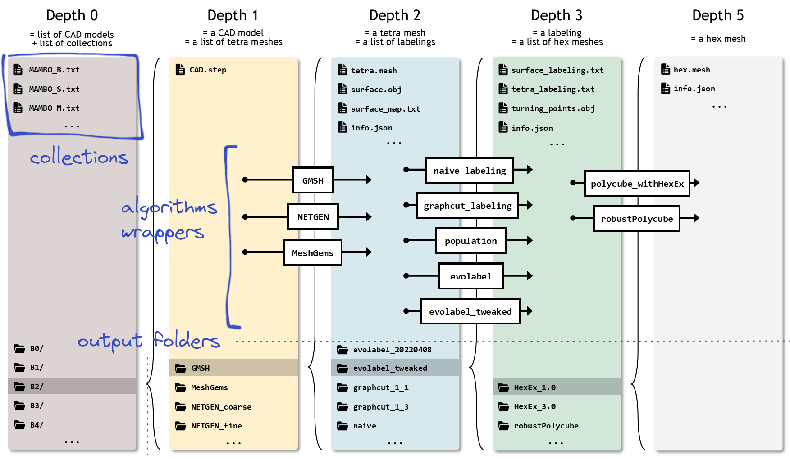

# Shared polycube pipeline



The goal of this project is to unify multiple polycube-based hex-mesh generation algorithms with a straightforward syntax, hiding their specific command line interface. All input/ouput data is gathered in a shared data folder. 

Example:
```bash
# tetrahedralization of the B0 CAD model
./MeshGems ~/SharedData/B0 0.75 # max mesh size of 0.75

# labeling optimization with a Graph-cut algorithm
./graphcut_labeling ~/SharedData/B0/MeshGems_0.75 # default is compactness=1, fidelity=3

# hexahedral mesh extraction with libHexEx
./polycube_withHexEx ~/SharedData/B0/MeshGems_0.75/graphcut_1_3 3.0 # scale factor of 3
```

**Table of content**

[Requirements](#requirements) : Everything on which this project is based

[Build & config](#build--config) : How to build and how to link to external software

[Algorithms](#algorithms) : List of the algorithms wrappers and their usage

[Other programs](#other-programs) : Additional usefull apps

[Files](#files) : Description of the files used and their syntax

# Requirements

This project is not expected to compile on other platforms than Linux. Tested on Fedora 34.

- a C++ 17 compiler
- [CMake](https://cmake.org/download/)
- [Genomesh](https://github.com/LIHPC-Computational-Geometry/genomesh) (clone & build `population`, `tris_to_tets`, `naive_labeling`, `graphcut_labeling` and `labeling_stats`. other apps may be unmaintained)
- [Evocube tweaks](https://github.com/LIHPC-Computational-Geometry/evocube_tweaks) (clone & build)
- [fastbndpolycube](https://github.com/fprotais/fastbndpolycube) (clone & build)
- for [`GMSH`](#gmsh), the [`gmsh`](https://gmsh.info/) and the [`meshio`](https://github.com/nschloe/meshio) python packages
- for [`NETGEN`](#netgen) or [`MeshGems`](#meshgems), the [SALOME plateform](https://www.salome-platform.org/?page_id=145). Note that MeshGems requires a licence from [Distene](https://www.spatial.com/products/3d-precise-mesh) (Dassault Systèmes)
- for [`robustPolycube`](#robustpolycube), [robustPolycube](https://github.com/fprotais/robustPolycube) (clone & build)
- for the visualization, [Graphite](https://github.com/BrunoLevy/GraphiteThree) (clone & build)

The [cxxopts](https://github.com/jarro2783/cxxopts), [json](https://github.com/nlohmann/json) and [ultimaille](https://github.com/ssloy/ultimaille) dependencies are included as submodules.

# Build & config

```bash
git clone --recurse-submodules https://github.com/LIHPC-Computational-Geometry/shared-polycube-pipeline.git
cd shared-polycube-pipeline
mkdir build
cd build/
cmake ..
make
```

Update `paths.json` with the location of SALOME, Genomesh, Evocube tweaks, robustPolycube and fastbndpolycube :

```json
{
    "working_data_folder": "path/to/your/shared/data/folder/",
    "salome": "path/to/SALOME/folder/",
    "genomesh": "path/to/Genomesh/build/folder/",
    "evocube_tweaks": "path/to/evocube_tweaks/build/folder/",
    "robustPolycube": "path/to/robustPolycube/build/folder/",
    "fastbndpolycube": "path/to/fastbndpolycube/build/folder/"
}
```

And create an environment variable `GRAPHITE` with the path to the Graphite executable.

```bash
#in your ~/.bashrc
export GRAPHITE=path/to/Graphite/binary
```

# Algorithms

See `apps/<name>.cpp`

All wrappers can work on a list of inputs (a [collection](#collections))

## `GMSH`

```txt
Tetrahedral meshing of a .step geometry file with GMSH algorithm
Usage:
  ./GMSH [OPTION...] <input> <size> [output]

  -c, --comments TEXT          Comments about the aim of this execution 
                               (default: "")
  -h, --help                   Print help
  -i, --input PATH             Path to the input collection/folder
  -n, --no-output-collections  The program will not write output collections 
                               for success/error cases
  -o, --output NAME            Name of the output folder(s) to create. %s is 
                               replaced by 'size' and %d by the date and time 
                               (default: GMSH_%s)
  -s, --size VALUE             Size factor in ]0,1]
  -v, --version                Print the version (date of last modification) of 
                               the underlying executables
```

The script `python-scripts/step2mesh_GMSH.py` is called on each input. It opens `CAD.step` and write `tetra.vtk`, which is converted to `.mesh` (MEDIT) with `meshio`. Then `tris_to_tets` of Genomesh is used to extract the triangular surface mesh (`surface.obj`).

## `NETGEN`

```txt
Tetrahedral meshing of a .step geometry file with NETGEN algorithm
Usage:
  ./NETGEN [OPTION...] <input> <size> [output]

  -c, --comments TEXT          Comments about the aim of this execution 
                               (default: "")
  -h, --help                   Print help
  -i, --input PATH             Path to the input collection/folder
  -n, --no-output-collections  The program will not write output collections 
                               for success/error cases
  -o, --output NAME            Name of the output folder(s) to create. %s is 
                               replaced by 'size' and %d by the date and time 
                               (default: NETGEN_%s)
  -s, --size SIZE              The max mesh size
  -v, --version                Print the version (date of last modification) of 
                               the underlying executables
```

The script `python-scripts/step2mesh_SALOME.py` is called on each input. It opens `CAD.step` and write `tetra.mesh`. Then `tris_to_tets` of Genomesh is used to extract the triangular surface mesh (`surface.obj`).

## `MeshGems`

```txt
Tetrahedral meshing of a .step geometry file with MeshGems algorithms (MG-CADSurf & MG-Tetra)
Usage:
  ./MeshGems [OPTION...] <input> <size> [output]

  -c, --comments TEXT          Comments about the aim of this execution 
                               (default: "")
  -h, --help                   Print help
  -i, --input PATH             Path to the input collection/folder
  -n, --no-output-collections  The program will not write output collections 
                               for success/error cases
  -o, --output NAME            Name of the output folder(s) to create. %s is 
                               replaced by 'size' and %d by the date and time 
                               (default: MeshGems_%s)
  -s, --size SIZE              The max mesh size
  -v, --version                Print the version (date of last modification) of 
                               the underlying executables
```

The script `python-scripts/step2mesh_SALOME.py` is called on each input. It opens `CAD.step` and write `tetra.mesh`. Then `tris_to_tets` of Genomesh is used to extract the triangular surface mesh (`surface.obj`).

## `naive_labeling`

```txt
ompute a naive labeling based on the per-triangle closest direction
Usage:
  ./naive_labeling [OPTION...] <input> [output]

  -c, --comments TEXT          Comments about the aim of this execution 
                               (default: "")
  -h, --help                   Print help
  -i, --input PATH             Path to the input collection
  -n, --no-output-collections  The program will not write output collections 
                               for success/error cases
  -o, --output NAME            Name of the output folder(s) to create. %d is 
                               replaced by the date and time (default: naive)
  -v, --version                Print the version (date of last modification) of 
                               the underlying executables
```

It opens `surface.obj` and `surface_map.txt` and write `surface_labeling.txt` as well as `tetra_labeling.txt`. Then `labeling_stats` of Genomesh is used to compute the number of charts, the number of invalidities, the turning-points, etc.

## `graphcut_labeling`

```txt
Compute a labeling with a graph-cut optimization algorithm
Usage:
  ./graphcut_labeling [OPTION...] <input> [compactness] [fidelity] [output]

  -c, --comments TEXT          Comments about the aim of this execution 
                               (default: "")
      --compactness VALUE      Compactness coefficient for the graph-cut 
                               optimisation (default: 1)
      --fidelity VALUE         Fidelity coefficient for the graph-cut 
                               optimisation (default: 3)
  -h, --help                   Print help
  -i, --input PATH             Path to the input collection
  -n, --no-output-collections  The program will not write output collections 
                               for success/error cases
  -o, --output NAME            Name of the output folder(s) to create. %c is 
                               replaced by the compactness, %f by the fidelity 
                               and %d by the date and time (default: 
                               graphcut_%c_%f)
  -v, --version                Print the version (date of last modification) of 
                               the underlying executables
```

It opens `surface.obj` and `surface_map.txt` and write `surface_labeling.txt` as well as `tetra_labeling.txt`. Then `labeling_stats` of Genomesh is used to compute the number of charts, the number of invalidities, the turning-points, etc.

## `evolabel`

```txt
Apply the Evocube genetic labeling framework
Usage:
  ./evolabel [OPTION...] <input> [output]

  -c, --comments TEXT          Comments about the aim of this execution 
                               (default: "")
  -h, --help                   Print help
  -i, --input PATH             Path to the input collection
  -n, --no-output-collections  The program will not write output collections 
                               for success/error cases
  -o, --output NAME            Name of the output folder(s) to create. %d is 
                               replaced by the date and time (default: 
                               evolabel_%d)
  -v, --version                Print the version (date of last modification) of 
                               the underlying executables
```

It opens `surface.obj` and `surface_map.txt` and write `surface_labeling.txt` as well as `tetra_labeling.txt`, keeping also other output files like `logs.json` and `fast_polycube_surf.obj` (see [evocube](https://github.com/CorentinDumery/evocube)).

## `evolabel_tweaked`

Same as [`evolabel`](#evolabel), with small modifications aiming to reduce the number of invalid labelings produced (see [evocube_tweaks](https://github.com/LIHPC-Computational-Geometry/evocube_tweaks), under construction).

## `population`

```txt
Compute a labeling with the 2021 Evocube algorithm (hexercise)
Usage:
  ./population [OPTION...] <input> [output]

  -c, --comments TEXT          Comments about the aim of this execution 
                               (default: "")
  -h, --help                   Print help
  -i, --input PATH             Path to the input collection
  -n, --no-output-collections  The program will not write output collections 
                               for success/error cases
  -o, --output NAME            Name of the output folder(s) to create. %d is 
                               replaced by the date and time (default: 
                               population)
  -v, --version                Print the version (date of last modification) of 
                               the underlying executables
```

It opens `surface.obj` and `surface_map.txt` and write `surface_labeling.txt` as well as `tetra_labeling.txt`. Then `labeling_stats` of Genomesh is used to compute the number of charts, the number of invalidities, the turning-points, etc.

## `polycube_withHexEx`

```txt
Extract an hexahedral mesh from a labeled tetra mesh with libHexEx
Usage:
  ./polycube_withHexEx [OPTION...] <input> [output] [scale]

  -c, --comments TEXT          Comments about the aim of this execution 
                               (default: "")
  -h, --help                   Print help
  -i, --input PATH             Path to the input collection
  -n, --no-output-collections  The program will not write output collections 
                               for success/error cases
  -o, --output NAME            Name of the output folder(s) to create. %s is 
                               replaced by the scale and %d by the date and 
                               time (default: HexEx_%s)
  -s, --scale VALUE            Scaling factor applied before libHexEx (default: 
                               1.0)
  -v, --version                Print the version (date of last modification) of 
                               the underlying executable
```

It opens `tetra.mesh` with `tetra_labeling.txt` and write `hex.mesh`.

## `robustPolycube`

```txt
Extract an hexahedral mesh from a labeled tetra mesh with the implementation of "Robust Quantization for Polycube-Maps", F. Protais et al. 2022
Usage:
  ./robustPolycube [OPTION...] <input> [output] [scaling]

  -c, --comments TEXT          Comments about the aim of this execution 
                               (default: "")
  -h, --help                   Print help
  -i, --input PATH             Path to the input collection
  -n, --no-output-collections  The program will not write output collections 
                               for success/error cases
  -o, --output NAME            Name of the output folder(s) to create. %s is 
                               replaced by the scaling and %d by the date and 
                               time (default: robustPolycube_%s)
  -s, --scaling VALUE          Scaling applied before quantization (default: 
                               1.0)
  -v, --version                Print the version (date of last modification) of 
                               the underlying executables
```

Call `rb_generate_deformation` then `rb_generate_quantization` of [robustPolycube](https://github.com/fprotais/robustPolycube). It mainly opens `tetra.mesh` with `tetra_labeling.txt` and write `hex.mesh`. Other output files are `tetra_remesh.mesh` (same as `tetra.mesh`), `tetra_remesh_labeling.txt` (same as `tetra_labeling.txt`) and `polycuboid.mesh` (deformed `tetra_remesh.mesh`).

May open Graphite after each step, depending if you provided the Graphite path when compiling the underlying binaries.

## `postprocess`

Currently works on `robustPolycube` output folders only.

```txt
Hexahedral mesh quality improvement with pillowing and smoothing. Provided by the implementation of "Robust Quantization for Polycube-Maps", F. Protais et al. 2022
Usage:
  ./postprocess [OPTION...] <input> [output]

  -c, --comments TEXT          Comments about the aim of this execution 
                               (default: "")
  -h, --help                   Print help
  -i, --input PATH             Path to the input collection
  -n, --no-output-collections  The program will not write output collections 
                               for success/error cases
  -v, --version                Print the version (date of last modification) of 
                               the underlying executables
```

Apply pillowing and smoothing on `hex.mesh`, resulting `hex_postprocessed.mesh`

# Other programs

## `expand`

```txt
Expand a collection to its folder list
Usage:
  ./expand [OPTION...] <input>

  -h, --help        Print help
  -i, --input PATH  Path to the input collection
```

It also open expand nested collections, to list all the folders this collection includes.

## `custom_command`

```txt
./custom_command input_collection.txt command_to_execute [options]
```

For example:

```bash
# for each folder in the collection NETGEN_errors.txt,
# print the content of logs.txt
./custom_command ~/SharedData/NETGEN_errors.txt cat logs.txt

# for each folder in the collection MAMBO_CAD.txt,
# rename the file ending with .step by CAD.step
./custom_command ~/SharedData/MAMBO_CAD.txt mv *.step CAD.step
```

# Files

by alphabetical order

## Collections

= `.txt` files at the root of the data folder

A collection is a list of folders of same depth relative to the data folder. Collections can be used as input, and two collections are created/extended while an algorithm is runnning : one for the success cases, one for the error cases.

A collection can contain other collections.

Here is what a `MAMBO_Medium_NETGEN_0.75.txt` could look like :

```txt
# all Medium models meshed with NETGEN
# and a max mesh size of 0.75
M1/NETGEN_0.75/
M2/NETGEN_0.75/
M3/NETGEN_0.75/
M4/NETGEN_0.75/
M5/NETGEN_0.75/
M6/NETGEN_0.75/
M7/NETGEN_0.75/
M8/NETGEN_0.75/
M9/NETGEN_0.75/
```

## `CAD.step`

A 3D model in the STEP format (ISO 10303-21)

## `fast_polycube_surf.obj`

An output file of `evolabel` containing a quickly-estimated surface polycube

## `graphite.sh`

A bash script that open the lua script of the same folder with Graphite

## `hex.mesh`

An hexahedral mesh in the MEDIT format

## `hex_meshes_with_SJ.lua`

A lua script for Graphite that loads `hex_mesh_with_SJ.geogram`/`hex_postprocessed_with_SJ.geogram` with the right display settings.

With the inverse parula colormap, a cell with a Scaled Jacobian of 1 is blue, and one with a Scaled Jacobian of 0 is yellow.

## `hex_mesh_with_SJ.geogram`

The same hexahedral mesh as `hex.mesh`, with the Scaled Jacobian as per-cell attribute. [Geogram](https://github.com/BrunoLevy/geogram/wiki/Mesh) format.

## `hex_postprocessed.mesh`

An hexahedral mesh in the MEDIT format after `postprocess` being applied

## `hex_postprocessed_with_SJ.geogram`

The same hexahedral mesh as `hex_postprocessed.mesh`, with the Scaled Jacobian as per-cell attribute. [Geogram](https://github.com/BrunoLevy/geogram/wiki/Mesh) format.

## `info.json`

A JSON file with information about:
- which algorithm generated this folder, its parameters and some comments (if comments were given)
- the date & time of execution
- Statistics of the output data
  * Number of vertices/cells for a tetrahedral mesh
  * Number of charts/boundaries/corners/etc for a labeling
  * Number of vertices/cells & min Scaled Jacobian for an hexahedral mesh

## `labeled_surface.geogram`

The same triangular mesh as `surface.obj`, with the `surface_labeling.txt` as per-face attribute. [Geogram](https://github.com/BrunoLevy/geogram/wiki/Mesh) format.

## `labeled_surface.lua`

A lua script for Graphite that loads `labeled_surface.geogram` with the right display settings.

## `labeling_init.txt`

An output file of `evolabel` containing the surface labeling of the initial individual (ancestor), `evolabel` being a genetic algorithm. This labeling is obtained with a graph-cut optimization.

## `labeling_stats.txt`

A intermediate output file generated by [`labeling_stats`](https://github.com/LIHPC-Computational-Geometry/genomesh/blob/main/apps/labeling_stats.cpp) of Genomesh. Most of its content is copied into `info.json`.

## `logs.json`

An output file of `evolabel` with labeling statistics, number of generations, timings, etc.

## `logs.txt`

A text file containing the STDOUT and STDERR printings.

## `polycuboid.mesh`

A intermediate output file generated by [`robustPolycube`](#robustpolycube). A deformed [`tetra.mesh`](#tetramesh) with an axis-aligned surface.

## `surface.obj`

A triangular mesh storing the surface/boundary of `tetra.mesh` in the Wavefront format.

## `surface_labeling.txt`

A text file with as many lines as faces in `surface.obj`, associating each face to a label.

label|direction
:---:|:-------:
0 | +X
1 | -X
2 | +Y
3 | -Y
4 | +Z
5 | -Z

## `surface_map.txt`

A text file with 2 more lines than the number of faces in `surface.obj` ( $nb_{triangles} + 2$ ), that maps the surface mesh to the volumetric `tetra.mesh`. The two first lines store the number of faces ( $nb_{triangles}$ ) and the number of tetrahedra ( $nb_{tetrahedra}$ ). The $nb_{triangles}$ remaining lines associate each triangle to the corresponding cell's facet of tetrahedron. The ordering of the facets is the one of [Ultimaille](https://github.com/ssloy/ultimaille) : 

facet number|tetrahedron vertices
:----------:|:------------------:
0 | {1,2,3}
1 | {0,3,2}
2 | {0,1,3}
3 | {0,2,1}

For example:

```txt
11486 triangles
51212 tetrahedra
186621
186405
35512
...
```

has $11486 + 2$ lines, and triangle $0$ (= $3^{rd}$ line) is the $3^{rd}$ facet of the $32985^{th}$ tetrahedron, because $186621 = 3 \times nb_{tetrahedra} + 32985$.

## `tetra.mesh`

A tetrahedral mesh in the MEDIT format

## `tetra_and_surface_mesh.lua`

A lua script for Graphite that loads `tetra.mesh` and `surface.obj` with the right display settings.

## `tetra_labeling.txt`

Same labeling as `surface_labeling.txt` but using per-tetrahedron-facet labels instead of per-surface-triangle labels. Therefore it contains $nb_{tetrahedra} \times 4$ lines. See `surface_map.txt` for the facets ordering.

label|direction
:---:|:-------:
-1 = no label| 
0 | +X
1 | -X
2 | +Y
3 | -Y
4 | +Z
5 | -Z

The reason for having 2 labeling files is that some hexahedral mesh extraction algorithms use the surface labeling, and other ones the volumetric labeling.

## `tetra_remesh.mesh`

A intermediate output file generated by [`robustPolycube`](#robustpolycube). A re-meshing of [`tetra.mesh`](#tetramesh).

## `tetra_remesh_labeling.txt`

A intermediate output file generated by [`robustPolycube`](#robustpolycube). A copy of [`tetra_labeling.txt`](#tetralabelingtxt).

## `turning_points.obj`

A Wavefront mesh containing only vertices, which are the turning-points of the labeling, i.e. points on a boundary where the direction changes.
