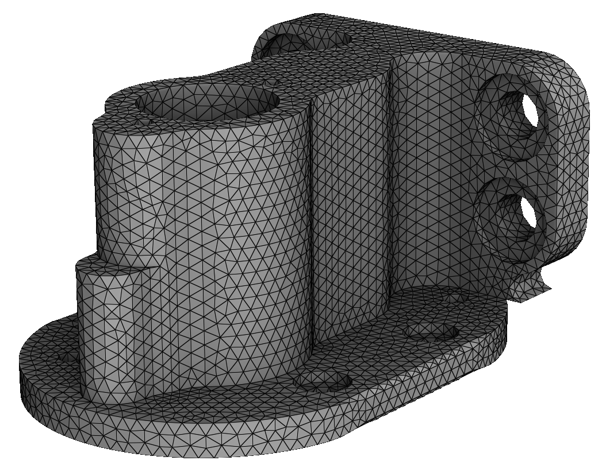
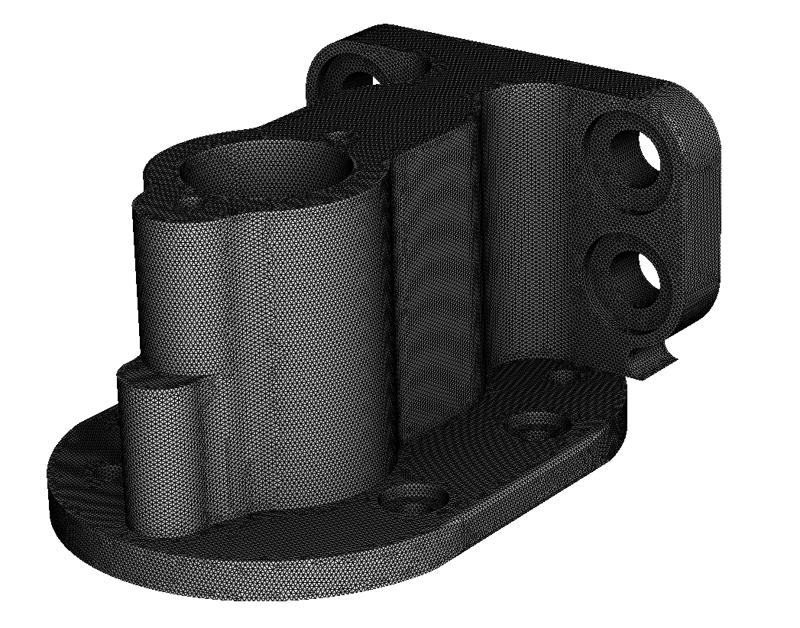
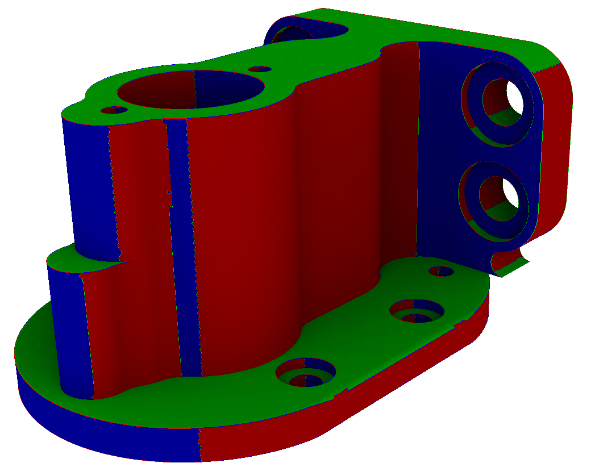
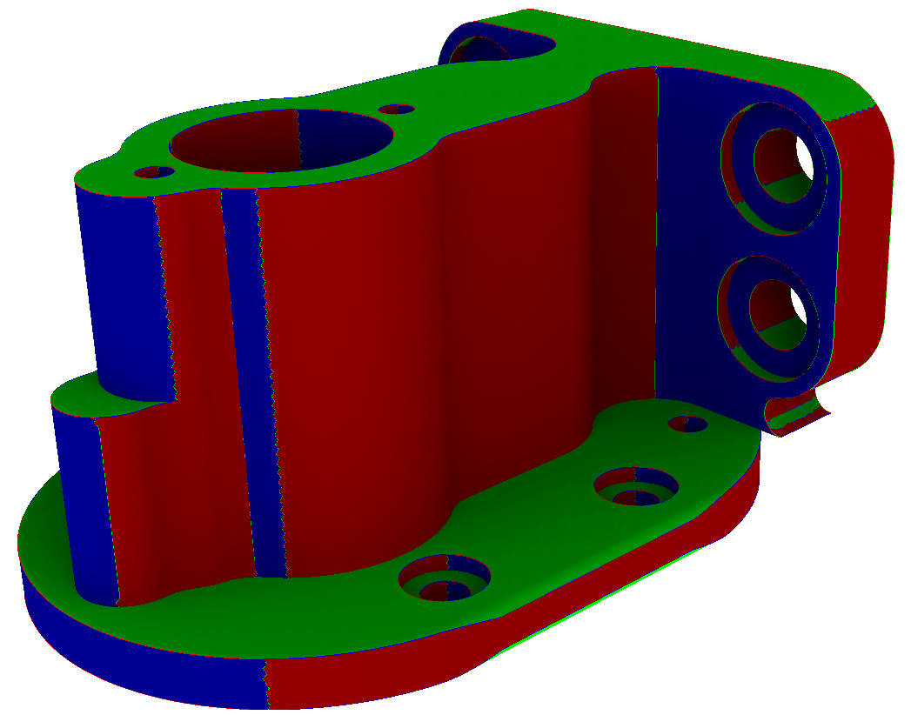
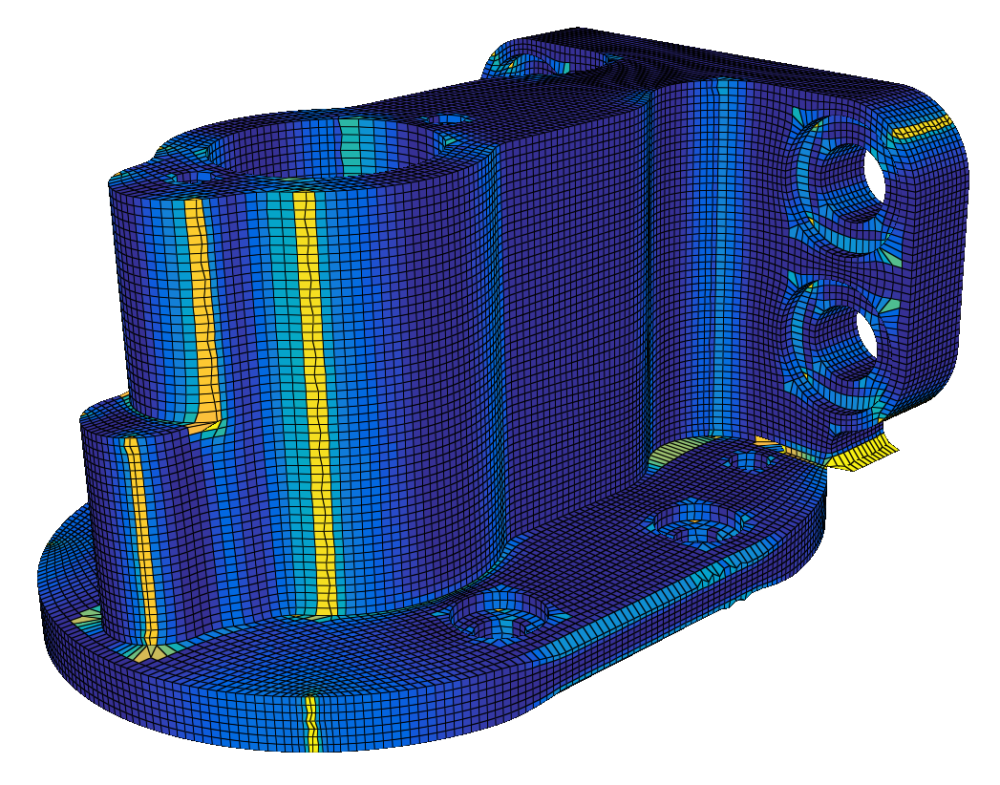
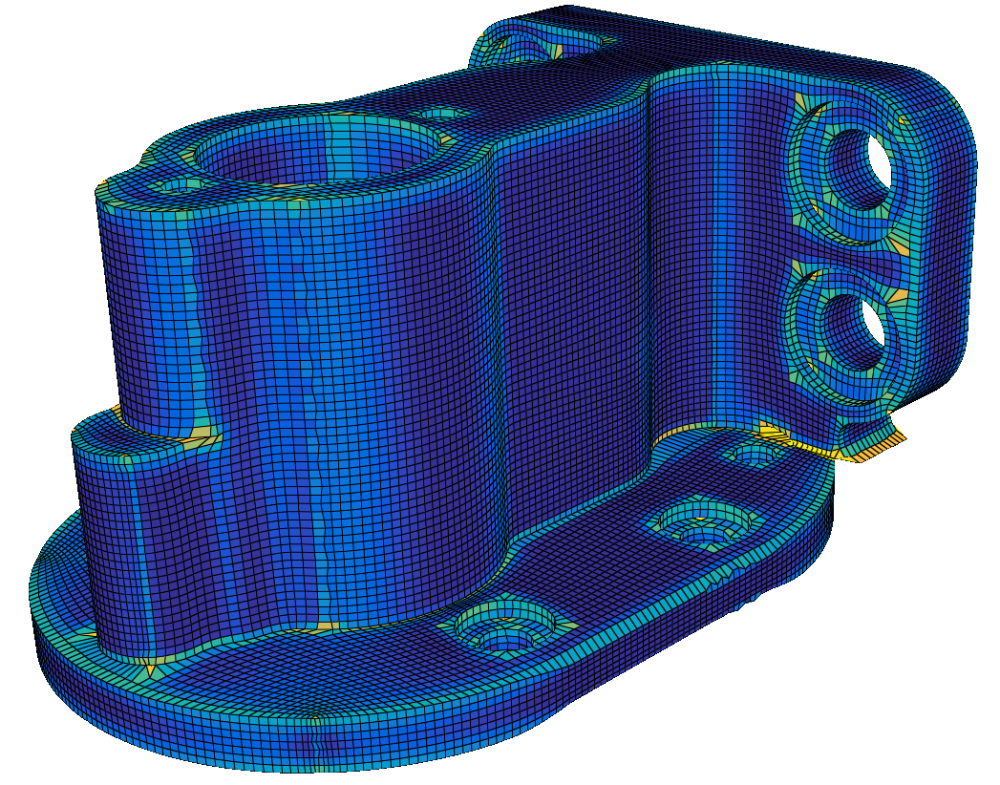
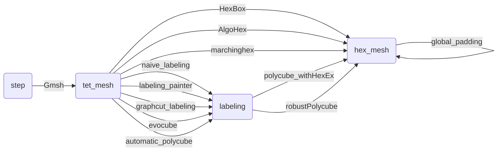

<div align="center">
  <h1>dds</h1><br/>
  <p>Semantic data folders</p><br/>
  <a href="https://github.com/LIHPC-Computational-Geometry/HexMeshWorkshop/blob/main/CHANGELOG.md">🔄 Changelog</a> • <a href="https://github.com/LIHPC-Computational-Geometry/HexMeshWorkshop/wiki/User-documentation">📖 User documentation</a> • <a href="https://github.com/LIHPC-Computational-Geometry/HexMeshWorkshop/wiki/Developer-documentation">🧑‍💻 Developer documentation</a>
</div>

Instead of having:
- a local data folder in each code repo (and a total mess inside each of them),
- to remember the command line interface of each executable (please, don't learn them by heart),
- to include other algorithms in your repo to compare them (adding dependencies and slipping towards enormous repos),

this project make it possible to keep each algorithm small and independent, and offering to the user an object-oriented API on data folders like, for a polycube-based hexahedral mesh generation:

<!-- import_MAMBO -->

<details>
<summary>
    Auto-download the <a href="https://gitlab.com/franck.ledoux/mambo">MAMBO</a> dataset:<br/>
    &emsp;<code>./import_MAMBO</code>
</summary>

```diff
  📂~/data
+   📁B0
+   📁B1
+   ...
+   📁S45
```

</details>

<!-- Gmsh -->

<details>
<summary>
    Tetrahedrization of M7 with <a href="http://gmsh.info/">Gmsh</a>:<br/>
    &emsp;<code>./Gmsh -i ~/data/M7 --mesh-size 0.2</code>
</summary>

<table>
<tr><td>

```diff
  📂~/data
    📂M7
+     📂Gmsh_0.2
+       📄tet.mesh
+       📄surface.obj
```

</td><td></td></tr>
</table>

</details>

<!-- Gmsh, finer mesh -->

<details>
<summary>
    Hmm, I need a finer mesh...</a><br/>
    &emsp;<code>./Gmsh -i ~/data/M7 --mesh-size 0.05</code>
</summary>

<table>
<tr><td>

```diff
  📂~/data
    📂M7
      📁Gmsh_0.2
+     📂Gmsh_0.05
+       📄tet.mesh
+       📄surface.obj
```

</td><td></td></tr>
</table>

</details>

<!-- naive_labeling -->

<details> 
<summary>
    Alright. I wonder what the naive labeling looks like.</a><br/>
    &emsp;<code>./naive_labeling -i ~/data/M7/Gmsh_0.05</code>
</summary>

<table>
<tr><td>

```diff
  📂~/data
    📂M7
      📁Gmsh_0.2
      📂Gmsh_0.05
+       📂naive_labeling
+         📄surface_labeling.txt
        📄tet.mesh
        📄surface.obj
```

</td><td></td></tr>
</table>

</details>

<!-- labeling_painter -->

<details> 
<summary>
    Okay, it's not valid. Let me tweak the labeling by hand.</a><br/>
    &emsp;<em>Sure:</em> <code>./labeling_painter -i ~/data/M7/Gmsh_0.05</code>
</summary>

<table>
<tr><td>

```diff
  📂~/data
    📂M7
      📁Gmsh_0.2
      📂Gmsh_0.05
        📁naive_labeling
+       📂labeling_painter
+         📄surface_labeling.txt
        📄tet.mesh
        📄surface.obj
```

</td><td></td></tr>
</table>

</details>

</details>

<!-- polycube_withHexEx -->

<details> 
<summary>
    Ho-ho! Can you extract a hex-mesh with <a href="https://www.graphics.rwth-aachen.de/software/libHexEx/">libHexEx</a>?<br/>
    &emsp;<em>Indeed I can:</em> <code>./polycube_withHexEx -i ~/data/M7/Gmsh_0.05/labeling_painter</code>
</summary>

<table>
<tr><td>

```diff
  📂~/data
    📂M7
      📁Gmsh_0.2
      📂Gmsh_0.05
        📁naive_labeling
        📂labeling_painter
+         📂polycube_withHexEx_1.0
+           📄hex.mesh
          📄surface_labeling.txt
        📄tet.mesh
        📄surface.obj
```

</td><td></td></tr>
</table>

</details>

<!-- global_padding -->

<details> 
<summary>
    Fantastic!! Can you also apply a global padding? 🥺<br/>
    &emsp;<em>You know I'm just a Python script, right?</em><br/>
    &emsp;<code>./global_padding -i ~/data/M7/Gmsh_0.05/labeling_painter/polycube_withHexEx_1.0</code>
</summary>

<table>
<tr><td>

```diff
  📂~/data
    📂M7
      📁Gmsh_0.2
      📂Gmsh_0.05
        📁naive_labeling
        📂labeling_painter
          📂polycube_withHexEx_1.0
+           📂global_padding
+             📄hex.mesh
            📄hex.mesh
          📄surface_labeling.txt
        📄tet.mesh
        📄surface.obj
```

</td><td></td></tr>
</table>

</details><br/>

File format conversions required by some algorithms are automatic.

Overview of the data subfolder types (boxes) and the wrapped algorithms (arrows):



Repository structure:
- [`from_cli`](from_cli/): scripts to interact with the database from the command line
- [`from_python`](from_python/): scripts to interact with the database from Python
- [`glue_code`](glue_code/): pieces of code for other softwares
- [`img`](img/): images displayed in the README
- [`modules`](modules/): Python modules internal to the project

<details>
<summary>Yet another architecture revision</summary>

Idea: declarative approach, infrastructure-as-code (like Terraform).
Instead of editing Python scripts to describe data subfolder types and algorithms,
we would rely on YAML files :
- `data_subfolder_types/*.yml` : a type of data subfolder. interpret a folder as an object. description of the expected filenames inside
- `algorithms/*.yml` : an wrapper around an executable, working on a specific data subfolder type

There will be Python script for optional pre- and post-processing for algorithms, as well as for custom algorithms (not based on an external executable)

Then we would have a `dds.py` that parse the necessary YAML files for the given instructions, eg:
- run an algorithm: `./dds.py run <algo_name> <input_folder>`
- print children of a given data subfolder: `./dds.py children <input_folder>`
- print history of a given data subfolder: `./dds.py history <input_folder>`
- list all data subfolder folder types: `./dds.py types list`
- print info about a specific data subfolder type: `./dds.py types info <type_name>`
- list all algorithms: `./dds.py algos list`
- print info about a specific algorithm: `./dds.py algos info <algo_name>`

Remaining design choices:
- (data subfolder types) how to describe views? A `<data-subfolder-type>.<view-name>.yml` next to the `<data-subfolder-type>.yml`?
- (data subfolder types) how to have an equivalent of `labeling.get_labeling_stats_dict()`, `labeling.has_valid_labeling()`... Some algorithms should be defined as a Python script

Note:
- (algorithms) to access a file in the (grand)parent folder, we no longer specify the reverse depth. We need to go up until the filename in found, and potentially restrict 2 data subfolder types to use the same filename and filename keyword.

</details>