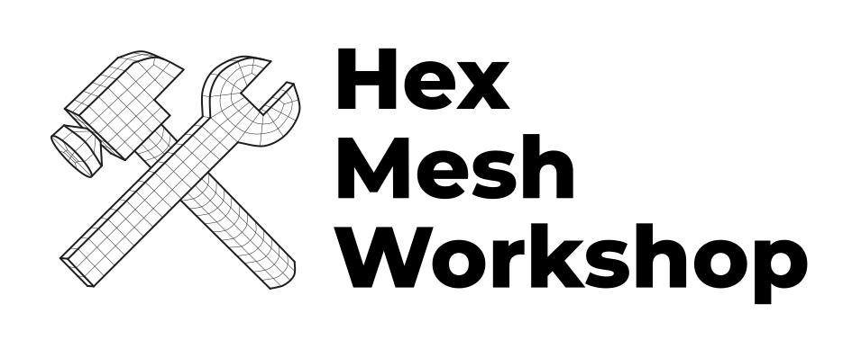
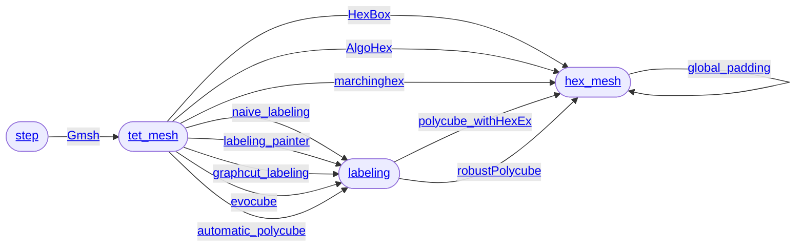

<p align="center">
  <picture>
    <source media="(prefers-color-scheme: dark)" srcset="img/logo_white.png">
    <source media="(prefers-color-scheme: light)" srcset="img/logo_black.png">
    
  </picture><br/>
  <a href="https://github.com/LIHPC-Computational-Geometry/HexMeshWorkshop/blob/main/CHANGELOG.md">🔄 Changelog</a> • <a href="https://github.com/LIHPC-Computational-Geometry/HexMeshWorkshop/wiki/User-documentation">📖 User documentation</a> • <a href="https://github.com/LIHPC-Computational-Geometry/HexMeshWorkshop/wiki/Developer-documentation">🧑‍💻 Developer documentation</a>
</p>

High-level interface for hex-meshing algorithms.

Instead of having:
- a local data folder in each code repo (and a total mess inside each of them),
- to remember the command line interface of each executable (please, don't learn them by heart),
- to include other algorithms in your repo to compare them (adding dependencies and slipping towards enormous repos),

this project make it possible to keep each algorithm small and independant, and offering to the user an object-oriented API on data folders like:

<!-- import_MAMBO -->

<details>
<summary>
    Auto-download the <a href="https://gitlab.com/franck.ledoux/mambo">MAMBO</a> dataset:<br/>
    &emsp;<code>./import_MAMBO</code>
</summary>

```diff
  📂~/data
+   📁B0
+   📁B1
+   ...
+   📁S45
```

</details>

<!-- Gmsh -->

<details>
<summary>
    Tetrahedrization of M7 with <a href="http://gmsh.info/">Gmsh</a>:<br/>
    &emsp;<code>./Gmsh -i ~/data/M7 --mesh-size 0.2</code>
</summary>

<table>
<tr><td>

```diff
  📂~/data
    📂M7
+     📂Gmsh_0.2
+       📄tet.mesh
+       📄surface.obj
```

</td><td></td></tr>
</table>

</details>

<!-- Gmsh, finer mesh -->

<details>
<summary>
    Hmm, I need a finer mesh...</a><br/>
    &emsp;<code>./Gmsh -i ~/data/M7 --mesh-size 0.05</code>
</summary>

<table>
<tr><td>

```diff
  📂~/data
    📂M7
      📁Gmsh_0.2
+     📂Gmsh_0.05
+       📄tet.mesh
+       📄surface.obj
```

</td><td></td></tr>
</table>

</details>

<!-- naive_labeling -->

<details> 
<summary>
    Alright. I wonder what the naive labeling looks like.</a><br/>
    &emsp;<code>./naive_labeling -i ~/data/M7/Gmsh_0.05</code>
</summary>

<table>
<tr><td>

```diff
  📂~/data
    📂M7
      📁Gmsh_0.2
      📂Gmsh_0.05
+       📂naive_labeling
+         📄surface_labeling.txt
        📄tet.mesh
        📄surface.obj
```

</td><td></td></tr>
</table>

</details>

<!-- labeling_painter -->

<details> 
<summary>
    Okay, it's not valid. Let me tweak the labeling by hand.</a><br/>
    &emsp;<em>Sure:</em> <code>./labeling_painter -i ~/data/M7/Gmsh_0.05</code>
</summary>

<table>
<tr><td>

```diff
  📂~/data
    📂M7
      📁Gmsh_0.2
      📂Gmsh_0.05
        📁naive_labeling
+       📂labeling_painter
+         📄surface_labeling.txt
        📄tet.mesh
        📄surface.obj
```

</td><td></td></tr>
</table>

</details>

</details>

<!-- polycube_withHexEx -->

<details> 
<summary>
    Ho-ho! Can you extract a hex-mesh with <a href="https://www.graphics.rwth-aachen.de/software/libHexEx/">libHexEx</a>?<br/>
    &emsp;<em>Indeed I can:</em> <code>./polycube_withHexEx -i ~/data/M7/Gmsh_0.05/labeling_painter</code>
</summary>

<table>
<tr><td>

```diff
  📂~/data
    📂M7
      📁Gmsh_0.2
      📂Gmsh_0.05
        📁naive_labeling
        📂labeling_painter
+         📂polycube_withHexEx_1.0
+           📄hex.mesh
          📄surface_labeling.txt
        📄tet.mesh
        📄surface.obj
```

</td><td></td></tr>
</table>

</details>

<!-- global_padding -->

<details> 
<summary>
    Fantastic!! Can you also apply a global padding? 🥺<br/>
    &emsp;<em>You know I'm just a Python script, right?</em><br/>
    &emsp;<code>./global_padding -i ~/data/M7/Gmsh_0.05/labeling_painter/polycube_withHexEx_1.0</code>
</summary>

<table>
<tr><td>

```diff
  📂~/data
    📂M7
      📁Gmsh_0.2
      📂Gmsh_0.05
        📁naive_labeling
        📂labeling_painter
          📂polycube_withHexEx_1.0
+           📂global_padding
+             📄hex.mesh
            📄hex.mesh
          📄surface_labeling.txt
        📄tet.mesh
        📄surface.obj
```

</td><td></td></tr>
</table>

</details><br/>

File format conversions required by some algorithms are automatic.

Overview of the data subfolder types (boxes) and the wrapped algorithms (arrows):


